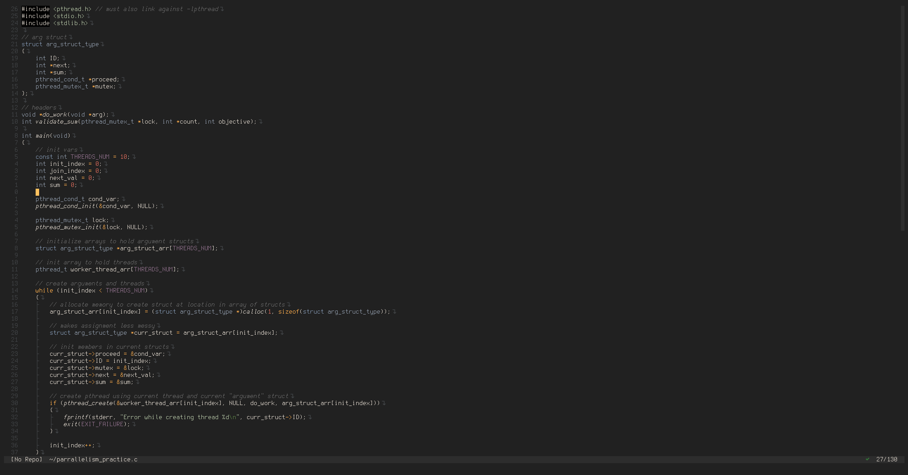

# nvim-docs-view

A neovim plugin to display lsp hover documentation in a side panel.

> Inspired by the VSCode extension [Docs View](https://marketplace.visualstudio.com/items?itemName=bierner.docs-view).



## Installation

Using [packer.nvim](https://github.com/wbthomason/packer.nvim)

```lua
use {
  "amrbashir/nvim-docs-view",
  opt = true,
  cmd = { "DocsViewToggle" },
  config = function()
    require("docs-view").setup {
      position = "right",
      width = 60,
    }
  end
}
```

Using [vim-plug](https://github.com/junegunn/vim-plug)

```viml
Plug 'amrbashir/nvim-docs-view', { 'on': 'DocsViewToggle'}

lua << EOF
  require("docs-view").setup {
    position = "right",
    width = 60,
  }
EOF
```

## Options

- `position`:
  - description: Determines where to open the docs view panel.
  - type: `string`
  - default: `right`
  - possible: `right` | `left` | `top` | `bottom`
- `height`:
  - description: Hieght of the docs view panel when position is set to `top` or `bottom`
  - type: `number`
  - default: `10`
- `width`:
  - description: Width of the docs view panel when position is set to `right` or `left`
  - type: `number`
  - default: `60`
- `update_mode`:
  - description: Determines the mechanism used to update the docs view panel content. If `auto`, the content will update upon cursor move. If `manual`, the content will only update once `:DocsViewUpdate` is called.
  - type: `string`
  - default: `auto`
  - possible: `auto` | `manual`

## Commands

- `:DocsViewToggle` to open/close the docs view panel.
- `:DocsViewUpdate` to manually update the docs view panel (will open the docs view panel if necessary).

## LICENSE

[MIT](./LICENSE) © Amr Bashir
